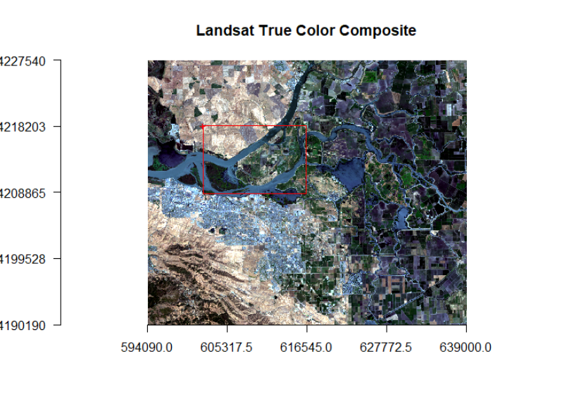

```{r setup, include=FALSE}
knitr::opts_chunk$set(echo = TRUE)
```

## Remote Sensing Image Analysis

### Exploration

```{r}
# download the data
dir.create('data', showWarnings = FALSE)
if (!file.exists('data/rs/samples.rds')) {
    download.file('https://biogeo.ucdavis.edu/data/rspatial/rsdata.zip', dest = 'data/rsdata.zip')
    unzip('data/rsdata.zip', exdir='data')
}

library(raster)
# Blue
b2 <- raster('data/rs/LC08_044034_20170614_B2.tif')
# Green
b3 <- raster('data/rs/LC08_044034_20170614_B3.tif')
# Red
b4 <- raster('data/rs/LC08_044034_20170614_B4.tif')
# Near Infrared (NIR)
b5 <- raster('data/rs/LC08_044034_20170614_B5.tif')

# NIR, Red, Green stack
s <- stack(b5, b4, b3)

filenames <- paste0('data/rs/LC08_044034_20170614_B', 1:11, ".tif")
landsat <- stack(filenames)
landsat
```

```{r}
# plotting example
par(mfrow = c(2,2))
plot(b2, main = "Blue", col = gray(0:100 / 100))
plot(b3, main = "Green", col = gray(0:100 / 100))
plot(b4, main = "Red", col = gray(0:100 / 100))
plot(b5, main = "NIR", col = gray(0:100 / 100))
```

```{r}
# create stack from red, green blue
landsatRGB <- stack(b4, b3, b2)
# composite color plot, linearly stretching values
plotRGB(landsatRGB, axes = TRUE, stretch = "lin", main = "Landsat True Color Composite")
```

```{r}
par(mfrow = c(1,2))
# RGB
plotRGB(landsatRGB, axes=TRUE, stretch="lin", main="Landsat True Color Composite")
# NIR, R, G
landsatFCC <- stack(b5, b4, b3)
plotRGB(landsatFCC, axes=TRUE, stretch="lin", main="Landsat False Color Composite")
```

**Question 1:** Use the plotRGB function with RasterStack `landsat` to create a true and false color composite (hint remember the position of the bands in the stack).


Landsat layers: Ultra Blue, Blue, Green, Red, Near Infrared (NIR), Shortwave Infrared (SWIR) 1, Shortwave Infrared (SWIR) 2, Panchromatic, Cirrus, Thermal Infrared (TIRS) 1, Thermal Infrared (TIRS) 2.

```{r}
par(mfrow = c(1,2))
plotRGB(subset(landsat, 4:2), axes=TRUE, stretch="lin", main="Landsat True Color Composite")
plotRGB(subset(landsat, 5:3), axes=TRUE, stretch="lin", main="Landsat False Color Composite")
```

```{r}
# only keep layers we need
landsat <- subset(landsat, 1:7)
# rename layers for clarity
names(landsat) <- c('ultra-blue', 'blue', 'green', 'red', 'NIR', 'SWIR1', 'SWIR2')
```

```{r}
extent(landsat)
# crop landsat to defined extent
e <- extent(624387, 635752, 4200047, 4210939)
landsatcrop <- crop(landsat, e)
```

**Question 2:** Interactive selection from the image is also possible. Use `drawExtent` and `drawPoly` to select an area of interest.




**Question 3:** Use the RasterStack `landsatcrop` to create a true and false color composite.

```{r}
par(mfrow = c(1,2))
plotRGB(subset(landsatcrop, 4:2), axes=TRUE, stretch="lin", main="Landsat True Color Composite")
plotRGB(subset(landsatcrop, 5:3), axes=TRUE, stretch="lin", main="Landsat False Color Composite")
```


```{r}
# example relationship between bands
pairs(landsatcrop[[1:2]], main = "Ultra-blue versus Blue")

# extracting pixel values example
# load the polygons with land use land cover information
samp <- readRDS('data/rs/samples.rds')
# generate 300 point samples from the polygons
ptsamp <- spsample(samp, 300, type='regular')
# add the land cover class to the points
ptsamp$class <- over(ptsamp, samp)$class
# extract values with points
df <- extract(landsat, ptsamp)
# To see some of the reflectance values
head(df)

# getting mean spectrum for different class types
ms <- aggregate(df, list(ptsamp$class), mean)
# instead of the first column, we use row names
rownames(ms) <- ms[,1]
ms <- ms[,-1]
# Create a vector of color for the land cover classes for use in plotting
mycolor <- c('darkred', 'yellow', 'burlywood', 'cyan', 'blue')
#transform ms from a data.frame to a matrix
ms <- as.matrix(ms)
# First create an empty plot
plot(0, ylim=c(0,0.6), xlim = c(1,7), type='n', xlab="Bands", ylab = "Reflectance")
# add the different classes
for (i in 1:nrow(ms)){
  lines(ms[i,], type = "l", lwd = 3, lty = 1, col = mycolor[i])
}
# Title
title(main="Spectral Profile from Landsat", font.main = 2)
# Legend
legend("topleft", rownames(ms),
       cex=0.8, col=mycolor, lty = 1, lwd =3, bty = "n")
```

### Basic Mathematical Operations

```{r}
# function to compute NDVI from raster stack with given band numbers for NIR and R
vi <- function(img, k, i) {
  bk <- img[[k]]
  bi <- img[[i]]
  vi <- (bk - bi) / (bk + bi)
  return(vi)
}

# For Landsat NIR = 5, red = 4.
ndvi <- vi(landsat, 5, 4)
plot(ndvi, col = rev(terrain.colors(10)), main = "Landsat-NDVI")
```

**Question 1:** Adapt the code shown above to compute indices to identify i) water and ii) built-up. Hint: Use the spectral profile plot to find the bands having maximum and minimum reflectance for these two classes.

```{r}
# water has larger normalized difference between ultra blue and swir2 compared to other classes
wi = function(raster, ultra_blue, swir2){
  ub = raster[[ultra_blue]]
  s2 = raster[[swir2]]
  return((ub-s2)/(ub+s2))
}

# compute index for water
wi_ras = wi(landsat, 1, 7)
# only show values above threshold of 0.4
wi_ras_mask = wi_ras
wi_ras_mask[wi_ras < 0.4] = NA
# watery color ramp
pal = colorRampPalette(c("light blue", "blue"))
plot(wi_ras_mask, col=pal(10), main="Water Cover")
```

```{r}
# built is trickier, doesn't have larger normalized difference between any two bands compared to other classes, but it does seem to have smallest normalized absolute difference between ultra blue and SWIR1
bi = function(raster, ultra_blue, swir_1){
  b1 = raster[[ultra_blue]]
  b2 = raster[[swir_1]]
  return(1 - abs(b1-b2)/(b1+b2))
}

bi_ras = bi(landsat, 1, 6)
bi_ras_mask = bi_ras
bi_ras_mask[bi_ras< 0.8] = NA
plot(bi_ras_mask, col=pal(10), main="Built Cover")
```

```{r}
# view histogram of data
hist(ndvi,
     main = "Distribution of NDVI values",
     xlab = "NDVI",
     ylab= "Frequency",
     col = "wheat",
     xlim = c(-0.5, 1),
     breaks = 30,
     xaxt = 'n')
axis(side=1, at = seq(-0.5,1, 0.05), labels = seq(-0.5,1, 0.05))
```

**Question 2:** Make histograms of the values the vegetation indices developed in question 1.

```{r}
hist(wi_ras,
     main = "Distribution of Water Index values",
     xlab = "Water Index",
     ylab= "Frequency",
     col = "blue",
     xlim = c(-0.4, 1),
     breaks = 30,
     xaxt = 'n')
axis(side=1, at = seq(-0.5,1, 0.05), labels = seq(-0.5,1, 0.05))
```

```{r}
hist(bi_ras,
     main = "Distribution of Built Index values",
     xlab = "Built Index",
     ylab= "Frequency",
     col = "wheat",
     xlim = c(0, 1),
     breaks = 30,
     xaxt = 'n')
axis(side=1, at = seq(-0.5,1, 0.05), labels = seq(-0.5,1, 0.05))
```

**Question 3:** Is it possible to find water using thresholding of NDVI or any other indices?

The water index constructed above seems to identify water very well using the threshold of 0.4.


### Unsupervised Classification

```{r}
library(raster)
landsat5 <- stack('data/rs/centralvalley-2011LT5.tif')
names(landsat5) <- c('blue', 'green', 'red', 'NIR', 'SWIR1', 'SWIR2')
```

**Question 1:** Make a 3-band False Color Composite plot of `landsat5`.

```{r}
plotRGB(landsat5[[4:2]], stretch='lin', axes=TRUE, main='False Color Composite Image')
```

```{r}
ndvi <- (landsat5[['NIR']] - landsat5[['red']]) / (landsat5[['NIR']] + landsat5[['red']])

# Extent to crop ndvi layer
e <- extent(-121.807, -121.725, 38.004, 38.072)
# crop landsat by the extent
ndvi <- crop(ndvi, e)
# convert raster to matrix
nr <- getValues(ndvi)

set.seed(99)
# We want to create 10 clusters, allow 500 iterations, start with 5 random sets using "Lloyd" method
kmncluster <- kmeans(na.omit(nr), centers = 10, iter.max = 500, nstart = 5, algorithm="Lloyd")
# kmeans returns an object of class "kmeans"
str(kmncluster)
```

```{r}
# Use the ndvi object to set the cluster values to a new raster
knr <- setValues(ndvi, kmncluster$cluster)
# You can also do it like this
knr <- raster(ndvi)
values(knr) <- kmncluster$cluster
```

```{r}
# Define a color vector for 10 clusters (learn more about setting the color later)
mycolor <- c("#fef65b","#ff0000", "#daa520","#0000ff","#0000ff","#00ff00","#cbbeb5",
             "#c3ff5b", "#ff7373", "#00ff00", "#808080")
par(mfrow = c(1,2))
plot(ndvi, col = rev(terrain.colors(10)), main = 'Landsat-NDVI')
plot(knr, main = 'Unsupervised classification', col = mycolor )
```

**Question 2:** Plot 3-band RGB of `landsat5` for the subset (extent `e`) and result of `kmeans` clustering side-by-side and make a table of land-use land-cover labels for the clusters. E.g. cluster 4 and 5 are water.

```{r}
par(mfrow=c(1,2))
plotRGB(crop(landsat5[[3:1]], e), stretch='lin', axes=TRUE, main='True Color Composite Image')
plot(knr, main='Unsupervised Classification', col=mycolor)
```
```{r}
# first visually setting classes to land type and inspect...
class_colors = c('burlywood', 'darkred', 'cyan', 'blue', 'blue', 'cyan', 'yellow', 'darkred', 'yellow', 'burlywood')
class_names = c('fallow', 'built', 'open', 'water', 'water', 'open', 'cropland', 'built', 'cropland', 'fallow')

legend_colors = c('darkred', 'yellow', 'burlywood', 'cyan', 'blue')
legend_classes = c('built', 'cropland', 'fallow', 'open', 'water')

plot(knr, main='Unsupervised Classification', col=class_colors, xaxt='n', yaxt='n')
legend('left', legend=legend_classes, fill=legend_colors)

# table of clustered classes and corresponding land type
class_codes = 1:10
cbind(class_codes, class_names)
```


### Supervised Classification

Load and clean data, make sample points and plot it:

```{r}
library(raster)
nlcd <- brick('data/rs/nlcd-L1.tif')
names(nlcd) <- c("nlcd2001", "nlcd2011")
# The class names and colors for plotting
nlcdclass <- c("Water", "Developed", "Barren", "Forest", "Shrubland", "Herbaceous", "Planted/Cultivated", "Wetlands")
classdf <- data.frame(classvalue1 = c(1,2,3,4,5,7,8,9), classnames1 = nlcdclass)
# Hex codes of colors
classcolor <- c("#5475A8", "#B50000", "#D2CDC0", "#38814E", "#AF963C", "#D1D182", "#FBF65D", "#C8E6F8")
# Now we ratify (RAT = "Raster Attribute Table") the ncld2011 (define RasterLayer as a categorical variable). This is helpful for plotting.
nlcd2011 <- nlcd[[2]]
nlcd2011 <- ratify(nlcd2011)
rat <- levels(nlcd2011)[[1]]
#
rat$landcover <- nlcdclass
levels(nlcd2011) <- rat

set.seed(99)
# Sampling
samp2011 <- sampleStratified(nlcd2011, size = 200, na.rm = TRUE, sp = TRUE)

library(rasterVis)
plt <- levelplot(nlcd2011, col.regions = classcolor, main = 'Distribution of Training Sites')
print(plt + layer(sp.points(samp2011, pch = 3, cex = 0.5, col = 1)))
```

Extract the `landsat5` values from sample locations:

```{r}
landsat5 <- stack('data/rs/centralvalley-2011LT5.tif')
names(landsat5) <- c('blue', 'green', 'red', 'NIR', 'SWIR1', 'SWIR2')

# Extract the layer values for the locations
sampvals <- extract(landsat5, samp2011, df = TRUE)
# sampvals no longer has the spatial information. To keep the spatial information you use `sp=TRUE` argument in the `extract` function.
# drop the ID column
sampvals <- sampvals[, -1]
# combine the class information with extracted values
sampdata <- data.frame(classvalue = samp2011@data$nlcd2011, sampvals)
```

Make a Classification Tree Model:

```{r}
library(rpart)
# Train the model
cart <- rpart(as.factor(classvalue)~., data=sampdata, method = 'class', minsplit = 5)
# print(model.class)
# Plot the trained classification tree
plot(cart, uniform=TRUE, main="Classification Tree")
text(cart, cex = 0.8)

pr2011 <- predict(landsat5, cart, type='class')

pr2011 <- ratify(pr2011)
rat <- levels(pr2011)[[1]]
rat$legend <- classdf$classnames
levels(pr2011) <- rat
levelplot(pr2011, maxpixels = 1e6,
          col.regions = classcolor,
          scales=list(draw=FALSE),
          main = "Decision Tree classification of Landsat 5")
```

**Question 1:** Plot `nlcd2011` and `pr2011` side-by-side and comment about the accuracy of the prediction (e.g. mixing between cultivated crops, pasture, grassland and shrubs).

```{r}
library(gridExtra)
p1 = levelplot(nlcd2011, maxpixels = 1e6,
          col.regions = classcolor,
          scales=list(draw=FALSE),
          main = "Classification of Landsat 5")
p2 = levelplot(pr2011, maxpixels = 1e6,
          col.regions = classcolor,
          scales=list(draw=FALSE),
          main = "Decision Tree classification of Landsat 5")
grid.arrange(p1, p2, ncol=2)
```

As seen above, the decision tree classification does not perform very well overall. It does a decent job at classifying water, and it captures general macroscopic land cover variation, but overall most of the land area is misclassified. Though most of the eastern half is cropland, the classifier frequently mixed those classifications with forest, herbaceous, and shrubland.

#### Model Evaluation

```{r}
library(dismo)
set.seed(99)
j <- kfold(sampdata, k = 5, by=sampdata$classvalue)

x <- list()
for (k in 1:5) {
    train <- sampdata[j!= k, ]
    test <- sampdata[j == k, ]
    cart <- rpart(as.factor(classvalue)~., data=train, method = 'class', minsplit = 5)
    pclass <- predict(cart, test, type='class')
    # create a data.frame using the reference and prediction
    x[[k]] <- cbind(test$classvalue, as.integer(pclass))
}

y <- do.call(rbind, x)
y <- data.frame(y)
colnames(y) <- c('observed', 'predicted')
conmat <- table(y)
# change the name of the classes
colnames(conmat) <- classdf$classnames
rownames(conmat) <- classdf$classnames
conmat
```


**Question 2:** Comment on the misclassification between different classes.

From the matrix, it is clear that water was classified most accurately. Water appears to have the lowest false positive rate and lowest false negative rate. Many of the false positive/false negative rates for the other classes are above 50%. Barren land had a particularly bad false negative rate: true barren land was classified as both developed and herbaceous more often than barren.

**Question 3:** Can you think of ways to to improve the accuracy?

The accuracy may be improved by using more training data, using more predictor variables (i.e. more raster bands or raster band derivatives), or by using another classification method entirely. For example, a convolutional neural net might perform better at identifying built structures due to its consideration of neighborhoods surrounding each pixel.

```{r}
# number of cases
n <- sum(conmat)
# number of correctly classified cases per class
diag <- diag(conmat)
# Overall Accuracy
OA <- sum(diag) / n
OA
```

```{r}
# observed (true) cases per class
rowsums <- apply(conmat, 1, sum)
p <- rowsums / n
# predicted cases per class
colsums <- apply(conmat, 2, sum)
q <- colsums / n
expAccuracy <- sum(p*q)
kappa <- (OA - expAccuracy) / (1 - expAccuracy)
kappa
```

```{r}
# Producer accuracy
PA <- diag / colsums
# User accuracy
UA <- diag / rowsums
outAcc <- data.frame(producerAccuracy = PA, userAccuracy = UA)
outAcc
```

**Question 4:** Perform the classification using Random Forest classifiers from the `randomForest` package.

```{r}
library(randomForest)
rf = randomForest(as.factor(classvalue)~., data=sampdata, method='class', minsplit=5)

pr_rf <- predict(landsat5, rf, type='class')
```

**Question 5:** Plot the results of rpart and Random Forest classifier side-by-side.

```{r}
pr_rf <- ratify(pr_rf)
rat <- levels(pr_rf)[[1]]
rat$legend <- classdf$classnames
levels(pr_rf) <- rat

p1 = levelplot(pr_rf, maxpixels = 1e6,
          col.regions = classcolor,
          scales=list(draw=FALSE),
          main = "Random Forest")
p2 = levelplot(pr2011, maxpixels = 1e6,
          col.regions = classcolor,
          scales=list(draw=FALSE),
          main = "Decision Tree")
grid.arrange(p1, p2, ncol=2)
```

**Question 7 (optional):** We have trained the classifiers using 200 samples for each class. Investigate the effect of sample size on classification. Repeat the steps with different subsets, e.g. a sample size of 150, 100, 50 per class, and compare the results. Use the same holdout samples for model evaluation.

```{r}
# make subsets of sample data
ns = c(150, 100, 50)
classvals = c(1,2,3,4,5,7,8,9)
# get subset of n sample data values with classval
get_subset = function(classval, n){
  s = subset(sampdata, classvalue==classval)[1:n,]
  return(s)
}
# get n sample data values of each class
get_all_subs = function(n){
  s = lapply(classvals, FUN=get_subset, n=n)
  s = do.call("rbind", s)
  return(s)
}
# get test data (use remaining data held out from biggest subset)
get_test = function(classval){
  s = subset(sampdata, classvalue==classval)
  s = s[150:length(s),]
  return(s)
}
test = do.call("rbind", lapply(classvals, FUN=get_test))

subsets = lapply(ns, FUN=get_all_subs)

accuracies = c()
# make model for each subset and assess accuracy
for (subset in subsets){
  j <- kfold(subset, k = 5, by=subset$classvalue)
  x <- list()
  for (k in 1:5) {
      train <- subset[j!= k, ]
      cart <- rpart(as.factor(classvalue)~., data=train, method = 'class', minsplit = 5)
      pclass <- predict(cart, test, type='class')
      # create a data.frame using the reference and prediction
      x[[k]] <- cbind(test$classvalue, as.integer(pclass))
  }
  y <- do.call(rbind, x)
  y <- data.frame(y)
  colnames(y) <- c('observed', 'predicted')
  conmat <- table(y)
  # change the name of the classes
  colnames(conmat) <- classdf$classnames
  rownames(conmat) <- classdf$classnames
  # number of cases
  n <- sum(conmat)
  # number of correctly classified cases per class
  diag <- diag(conmat)
  # Overall Accuracy
  OA <- sum(diag) / n
  # save to output array
  accuracies = append(accuracies, OA)
}

data.frame(n=ns, accuracy=accuracies)
```

From the computed overall accuracies above, we see that sample size does not have much of an effect for n > 50.
